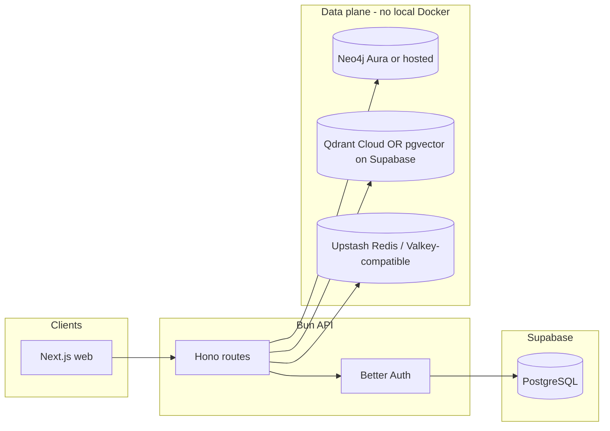

# ARGUS: SQLite → Supabase & Docker-Free DevOps Migration Plan

This document describes how to move **relational auth storage** from local SQLite to **Supabase (PostgreSQL)** and how to **retire local Docker Compose** while keeping the stack operable and easier for new contributors.

---

## 1. Current state (baseline)

| Concern | Technology | Where it lives |
|--------|------------|----------------|
| Auth & org/session tables | SQLite via `bun:sqlite` | `apps/api/src/auth.ts` → `argus-auth.db` |
| Raw SQL on auth DB | SQLite | `apps/api/src/routes/v1/admin.ts`, `apps/api/src/routes/v1/onboarding.ts` |
| Admin bootstrap | SQLite | `scripts/seed-admin.ts` |
| Graph (assets, CVEs, tenants) | Neo4j | `packages/graph`, env `NEO4J_*` |
| Vector search (CVE embeddings) | Qdrant | `packages/ai/src/embeddings.ts`, `QDRANT_URL` |
| Cache / queues | Valkey (Redis protocol) | `packages/cache`, `VALKEY_URL` |
| Local infra | Docker Compose | `docker/docker-compose.yml`; scripts `docker:up` / `docker:down` in root `package.json` |

**Important:** Supabase is **PostgreSQL-first**. It does **not** replace Neo4j’s graph engine or Qdrant’s vector API without further application changes. This plan treats **Supabase as the replacement for SQLite only**, and addresses **Docker removal** by moving Neo4j, Qdrant, and Valkey to **managed or install-free** alternatives.

---

## 2. Target architecture

**Streamlined outcome:**

- One **Supabase project** holds auth-related tables (and optionally `pgvector` later).
- **No `docker compose` required** for day-to-day dev: use cloud free/low tiers or team-shared dev instances documented in `.env.example`.
- **Single connection string** pattern: `DATABASE_URL` (and optional `DIRECT_URL` for migrations).

---

## 3. Phase A — Supabase project & PostgreSQL for Better Auth

### 3.1 Supabase setup

1. Create a project at [https://supabase.com](https://supabase.com).
2. In **Project Settings → Database**, copy:
   - **Connection string (URI)** — use **Session mode** for Better Auth / long-lived server connections, or the **pooler (transaction)** URL only if your ORM/driver explicitly supports it.
3. For schema migrations that cannot use the pooler, keep **Direct connection** as `DIRECT_URL` (Supabase documents this pattern for Prisma; same idea applies here).

### 3.2 Environment variables

Extend `packages/config/src/env.ts` and `.env.example` with something like:

- `DATABASE_URL` — primary Postgres URL (Supabase).
- `DIRECT_URL` (optional) — non-pooled URL for migrations.
- Do **not** commit service role keys to the app server unless required; Better Auth runs on your API and typically uses the DB connection string with a **restricted** DB user if you create one.

### 3.3 Better Auth: switch adapter from SQLite to PostgreSQL

Today, `apps/api/src/auth.ts` passes a `bun:sqlite` `Database` instance into `betterAuth({ database: db })`.

**Planned change:**

1. Align `better-auth` with the version that supports your chosen adapter (the repo already resolves `better-auth` with Kysely / Drizzle-related subpackages in the lockfile — pick **one** supported path and standardize):
   - **Kysely + `pg`** — common for server-side Bun/Node.
   - **Drizzle + `pg`** — if you prefer Drizzle elsewhere in the monorepo.
2. Replace `database: sqlite` with the official PostgreSQL-backed configuration from [Better Auth database docs](https://www.better-auth.com/docs/concepts/database) (verify exact API for your pinned version).
3. Run Better Auth migrations against Supabase (empty database first, then `getMigrations` / `runMigrations` as you do today in `auth.ts`).

### 3.4 Remove SQLite-specific artifacts

- Delete or stop writing `argus-auth.db`; add `*.db` to `.gitignore` if not already.
- Remove direct `bun:sqlite` usage from:
  - `apps/api/src/auth.ts`
  - `apps/api/src/routes/v1/admin.ts`
  - `apps/api/src/routes/v1/onboarding.ts`
  - `scripts/seed-admin.ts`
  - `apps/api/src/test-auth.ts` (update or remove)
- Remove `better-sqlite3` from `apps/api/package.json` if nothing else depends on it.
- Remove `bun-sqlite.d.ts` when no longer needed.

### 3.5 Replace raw SQLite SQL with Postgres-safe access

| Location | Current behavior | Migration approach |
|----------|------------------|---------------------|
| `admin.ts` | `SELECT ... FROM "member" ... JOIN "user"` via SQLite API | Use **shared Kysely/Drizzle client** with identical SQL (Postgres uses `"quoted"` identifiers — already aligned) **or** extend calls to `auth.api.*` if the plugin exposes member listing. |
| `onboarding.ts` | `INSERT INTO "member"` fallback | Prefer **`auth.api` organization membership** endpoints only; if a race condition required the manual insert, reimplement with a **transaction** in Postgres or fix upstream in plugin usage. |
| `seed-admin.ts` | `PRAGMA table_info`, `DELETE FROM ...` | Use Postgres `information_schema` / adapter APIs, or use **Better Auth admin APIs** exclusively for reset + signup + `setRole`. |

Use parameterized queries everywhere (`$1`, `$2` for `pg` or adapter equivalents) — **never** string-concat user input.

### 3.6 Data migration (SQLite → Supabase)

For **existing** `argus-auth.db` data you care about:

1. **Export** SQLite tables used by Better Auth (`user`, `session`, `account`, `verification`, `organization`, `member`, `invitation`, etc. — confirm against your live schema).
2. **Transform**:
   - SQLite `BOOLEAN` / datetime quirks → Postgres `timestamptz` / `boolean`.
   - Ensure UUID/text `id` columns match what Better Auth expects on Postgres.
3. **Import** via `COPY`, `psql`, or a one-off Bun script using `pg`.
4. Run Better Auth migration tool **once** on Supabase to ensure schema matches; reconcile any drift manually in a maintenance window.

If you do **not** need to preserve users, skip export/import and run fresh migrations + `seed-admin` against Supabase.

---

## 4. Phase B — Remove Docker dependency (Neo4j, Qdrant, Valkey)

Docker Compose today only runs these three services. “Streamlined” means **documented URLs** to replacements, not necessarily fewer databases.

### 4.1 Neo4j

- **Recommended:** [Neo4j Aura](https://neo4j.com/cloud/aura/) (free tier for small graphs) or another **hosted Neo4j** with Bolt access.
- Update `NEO4J_URI`, `NEO4J_USER`, `NEO4J_PASSWORD` in `.env.example` to placeholders for Aura-style URIs (`neo4j+s://...`).
- Keep `bun run db:init` / `db:seed` **unchanged** logically; they only need reachable Bolt endpoints.

### 4.2 Qdrant

- **Option 1 (minimal code):** [Qdrant Cloud](https://cloud.qdrant.io/) — set `QDRANT_URL` and `QDRANT_API_KEY`; `QdrantClient` in `packages/ai/src/embeddings.ts` already accepts URL + API key pattern (add key to client options if not wired yet).
- **Option 2 (consolidate on Supabase):** Enable **`pgvector`** in Supabase and rewrite `initQdrant`, `indexCVE`, and `searchCVEs` to use Postgres vector operations. This is **more work** but removes a separate vector vendor.

### 4.3 Valkey / Redis

- **Recommended:** [Upstash Redis](https://upstash.com/) (HTTPS Redis) or any Redis-compatible host; set `VALKEY_URL` (or rename env to `REDIS_URL` in a later cleanup for clarity).
- Verify `ioredis` in `packages/cache` supports your chosen URL (TLS, `rediss://`).

### 4.4 Repository cleanup

- Archive or delete `docker/docker-compose.yml` once the team agrees **no local containers** are required, **or** keep it behind a `docs/legacy-local-docker.md` note for offline development only.
- Remove or repurpose root scripts: `docker:up`, `docker:down`, `docker:logs`.
- Update `README.md` prerequisites: **Docker optional** → “managed services + Bun”.

---

## 5. Phase C — Verification & rollout

### 5.1 Checklist

- [ ] Sign up / sign in / session refresh against Supabase-backed Better Auth.
- [ ] Organization create + member list (`admin` + `onboarding` flows).
- [ ] Super-admin seed path (`scripts/seed-admin.ts`) on a clean Supabase DB.
- [ ] Neo4j: `db:init`, `db:seed`, tenant-scoped queries from API.
- [ ] Qdrant (or pgvector): CVE indexing + `cve` route semantic search.
- [ ] Cache: rate limiting or any Redis usage still connects.
- [ ] CI: add env secrets for a **throwaway** Supabase branch or use service containers if you must stay fully local in CI.

### 5.2 Risk notes

- **Connection limits:** Supabase free tier has low Postgres connection limits — use **pooling** and a **single** shared `pg` pool in the API process.
- **Latency:** Moving from localhost SQLite to remote Postgres adds RTT; keep sessions and queries tight; avoid N+1 raw queries in admin routes.
- **Neo4j remains mandatory** for current graph features unless you plan a separate graph migration (out of scope for this document).

---

## 6. Suggested implementation order

1. Add Supabase Postgres URLs to config + secrets; prove a **read-only** `SELECT 1` from the API.
2. Wire Better Auth to Postgres; run migrations; smoke-test auth.
3. Port `admin` / `onboarding` / `seed-admin` off `bun:sqlite`.
4. Stand up Aura + Qdrant Cloud + Upstash; point env; remove Docker scripts from default workflow.
5. Optional later: Qdrant → `pgvector` on Supabase to reduce moving parts.

---

## 7. File touch list (for implementers)

| Area | Files likely to change |
|------|-------------------------|
| Env & types | `packages/config/src/env.ts`, `.env.example` |
| Auth | `apps/api/src/auth.ts` |
| Routes | `apps/api/src/routes/v1/admin.ts`, `apps/api/src/routes/v1/onboarding.ts` |
| Scripts | `scripts/seed-admin.ts` |
| Deps | `apps/api/package.json` (add `pg`, remove `better-sqlite3`; add Kysely or Drizzle as chosen) |
| Types | `bun-sqlite.d.ts` (remove when unused) |
| Infra docs | `README.md`, root `package.json` docker scripts, `docker/docker-compose.yml` disposition |
| AI (optional vector move) | `packages/ai/src/embeddings.ts`, `scripts/seed.ts`, `apps/api/src/routes/v1/cve.ts` |

---

## 8. Definition of done

- No `argus-auth.db` or `bun:sqlite` in production or documented dev path.
- Auth and org data live in **Supabase PostgreSQL** with a repeatable migration story.
- **Docker is not required** for the documented quick start; Neo4j, vector, and cache are satisfied by **hosted** endpoints and env configuration only.
- README reflects the new onboarding steps in under ~10 minutes for a developer with keys.
